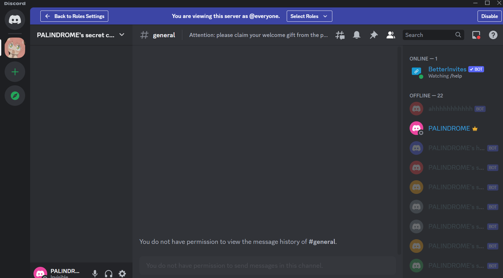
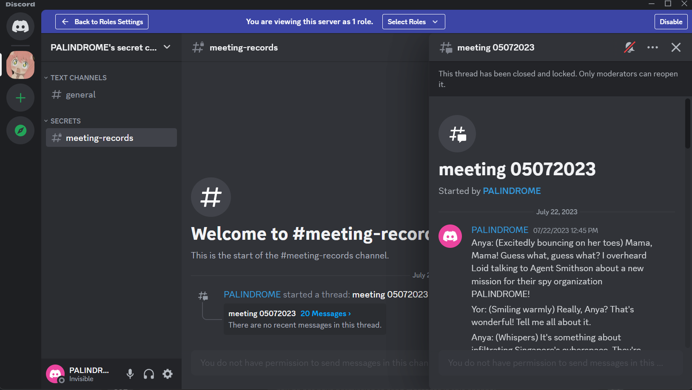

# PALINDROME's Invitation
Writeup by challenge author

## Category
Misc, OSINT

## Description
Valuable intel suggests that PALINDROME has established a secret online chat room for their members to discuss on plans to invade Singapore's cyber space. One of their junior developers accidentally left a repository public, but he was quick enough to remove all the commit history, only leaving some non-classified files behind. One might be able to just dig out some secrets of PALINDROME and get invited to their secret chat room...who knows? Start here: [https://github.com/palindrome-wow/PALINDROME-PORTAL](https://github.com/palindrome-wow/PALINDROME-PORTAL)

## Github repository content:
`.github/workflows/test_portal.yaml`:
```yaml
name: Test the PALINDROME portal

on:
   issues:
      types: [closed]

jobs:
   test:
      runs-on: windows-latest
      steps:
         - uses: actions/checkout@v3
         - name: Test the PALINDROME portal
           run: |
              C:\msys64\usr\bin\wget.exe '''${{ secrets.PORTAL_URL }}/${{ secrets.PORTAL_WELCOME }}''' -O test -d -v
              cat test
```

## Solution
1. Checking the github workflow file will immediately reveal the goal of the first step, which is to retrieve the value of the github secrets `secrets.PORTAL_URL` and `secrets.PORTAL_PASSWORD`. The issue tab is disabled so players cannot close any issue to trigger the workflow, but it has already been triggered and logs can be seen in the actions tab under the action named `Portal opening #2`. Some players may try to open a Pull Request to leak the secrets out using malicious workflows. This works only if the repository owner approves the workflow, which of course will not happen for this challenge.
2. Although Github will try to redact all strings that matches with the secrets, the error logs (the workflow is intended to error) of Windows version of `wget.exe` will reveal the `PORTAL_PASSWORD` as it will be added with HTML escape strings on `<`, escaping them as `%3C`. This causes the redacting to fail. As for the `PORTAL_URL`, one can get the ip address/domain name and port of it from the debug log outputs where it says `connecting to...`.
````
--2023-09-08 04:17:14--  (try:20)  ***/:dIcH:..uU9gp1%3C@%3C3Q%22DBM5F%3C)64S%3C(01tF(Jj%25ATV@$Gl
Found chals.tisc23.ctf.sg in host_name_addresses_map (0xa00027870)
Connecting to chals.tisc23.ctf.sg (chals.tisc23.ctf.sg)|18.143.127.62|:45938... Closed fd 4
````
PORTAL_URL is http://chals.tisc23.ctf.sg:45938/ and PORTAL_PASSWORD is `:dIcH:..uU9gp1<@<3Q"DBM5F<)64S<(01tF(Jj%ATV@$Gl` after replacing all `%3C` with `<`. This is also a `base85` encoded string that provides a supplementary hint to the next step: "PALINDROME has an AUTOMATED secretary", hinting at some sort of bot.
CyberChef should instantly give the reciept: `URL decode -> From Base85`. We know that the password is the string AFTER URL Decode because if it is exactly the same as URL encoded version, GitHub would have redacted it properly.
3. Upon visiting the portal and entering the right password, user will be given a discord invitation link that will allow them to join the discord server `PALINDROME's secret chat room`, but they will have no rights to do anything, not even seeing the channels list (custom clients like BetterDiscord will be able to see but it does not affect the solution).

4. If the user check the source of the page, they will get a token. This may not be obvious to some players, but the token is a discord bot token, an encrypted JWT with the first part that can be decoded via base64 into the discord user ID of the bot. This user ID can be openly searched on https://discord.id/.
5. This token is one of the many discord bots in the challenge server. Each of them has a common role of `PALINDROME'S SECRETARIES`, which slightly higher rights than the user themselves. One can take 2 approaches to find out the perissions that the bot has:
   1. Use the Discord API or any library for discord API to list the permissions of all roles in the server including the bot's roles.
   2. This requires the user to have figured out how to read the full conversation. See point 5 below. Assuming the user can read them, use the hint `66688` from the conversation in the `meeting-records` channel to calculate the permission code of the bot. This is how discord represents a bot's permission numerically. It can represent a unique combination of bot permissions. It is calculated from `66688 = 0x400 | 0x80 | 0x10000`, where `0x400` is `View Channels` permission, ` 0x80` is `View Audit Log`, `0x10000` is `Read Message History`. Given that the bot only has these 3 permissions, it should be obvious that view audit log is the uncommon one.
6. There is an archived thread (not message) in the `meeting-records` channel. If the user uses discord's message API to enumerate, they will only see the thread topic and misses the fact that it is in fact a thread, since discord API returns the topic as if it is a message by itself. If the user tries to enumerate normal, open threads in the channel, they will get nothing as the thread is archived and has to be retrieved with the specific API for archived threads. To read the full conversation, user has to enumerate `archieved threads` in the `meeting-records` channel and read the history of that thread.


7. In this thread, there is an entire [conversation](conversation.txt) written by ChatGPT using characters from the animation Spy X Family, and it reveals serval hints to the next step. One of them is the permission code, if the user has not figured that out already. The others are:
   1. The conversation mentions an 'invitation'. This is a double-reference to the challenge title, hinting that players are probably looking for another invite of some sort, like another invitation link to the challenge server. This hint must be considered together with the hint below.
   2. `client_id 107693687310623144` appears directly in the conversation. Googling this will yield only 1 result (as of 5 July 2023) and it is the oauth2 link to invite a discord bot named BetterInvite (a popular, public bot). The main feature of this bot is to assign users different roles in the server depending on which invitation link they used to join the server. This hopefully forms the last piece of the clue.
8. From these 3 clues, the user is expected to come up with the idea of viewing the audit log and look for instances of invite link creation. There were multiple created but most are deleted except for 2, and one of them will be the same they used to enter the server, so it should be obvious that the other one is the target. The correct link is also inviting to the `flag` channel instead of the `default` channel. Upon getting the link using the discord bot token given, they can enter the server and will automatically be assigned the `Admin` role, where they can view the flag in the `flag` channel.

Overall, this challenge aims to be creative and unique from typical CTF challenges that are RE/PWN heavy in nature. It tries to emulate a real-world source of data leaks and infiltration, from the unexpected github secrets leak, to the enumeration of a leaked discord token. This challenge took inspiration from various cloud challenges that leaked access tokens.

## Flag
`TISC{H4ppY_B1rThD4y_4nY4!}`

## Implementation
Behind the password checking portal (PALINDROME'S PORTAL), is a simple Selenium powered backend. It uses headless Chrome webdriver and pre-loaded local storage data to bypass requiring username and password to login to the Discord Developer Portal, where bots can be managed. This can bypass the need for email verification which discord forces every account to do on login attempts from new IP address.

Then, on each request, the backend will send a session cookie and the token for one of the many bots (PALINDROME's SECRETARIES) we created for the challenge to the user. This token is valid for 15min for that cookie. After 15min, the bot will be reset such that the token changes. All of these is done by using Selenium to click buttons on the Discord Developer Portal. The backend scales with newly added bots too. We had to expand from 15 bots to 22 during the CTF to address the concurrent demand.

Backend server code can be found at [password_checker.py](password_checker.py).

Code to generate new localstorage pickle for login is at [auto gen token.ipynb](auto%20gen%20token.ipynb). The pickle expires after about 1 month.

##  Challenges faced during CTF
* Some players quit the bot from the challenge server and created his own server with the bot, causing the next player to use the same bot (but different token) to have no solution. Some players feedback this and I manually reset those affected bots. Only 2 bots were found to be ever affected, and they are likely by the same player, so this was not a big issue, but still something that should be automated in the backend.
* Some players also changed the name of the bot, which allowed them to give hint/communicate with other players, although it is against their interest to do so if they want to win prizes. We did not observe any changes that could affect the fairness of the CTF so decided to not take any action.
* Discord has a hard limit of 25 bots per account so in the event of exceeding capacity, we need to scale across many accounts by running the same script on different ports with different localstorage data. Luckily this was not needed during TISC 2023 as players came staggered.